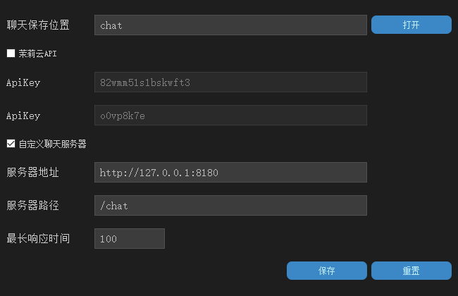

# 星期六

中文 | [English](doc/en//README_EN.md)

## 关于

作者：[此号已封12138](https://space.bilibili.com/40358750)

演示：[花费时间两周半 ChatGLM(清华源)+语音生成+L2D 的对话AI【此号已封】](https://www.bilibili.com/video/BV1SV4y1D7fG)

项目参考：

[【保姆级教程】教你使用群友语音快速得到一个AI群友 | 基于paddlespeech项目训练AI语音合成模型](https://www.bilibili.com/video/BV15e4y1c7ci)

[【AI虚拟主播】B站第一个开源的自主学习的虚拟主播！](https://www.bilibili.com/video/BV1WP411Z7qu) 

[AI-Vtuber](https://github.com/XzaiCloud/AI-Vtuber)

[【ChatGLM】本地版ChatGPT？6G显存可用！ChatGLM-6B 清华开源模型一键包发布 可更新](https://www.bilibili.com/video/BV1E24y1u7Go) 

 [ChatGLM-webui](https://github.com/Akegarasu/ChatGLM-webui)

[【有手就行】使用你自己的声音做语音合成](https://aistudio.baidu.com/aistudio/projectdetail/5003396)

[【有手就行】使用自己的声音做语音合成（二）本地部署](https://zhuanlan.zhihu.com/p/587765776)

[Live2DMascot](https://github.com/Arkueid/Live2DMascot)

[(vits+ChatGLM)采用清华开源模型ChatGLM的本地化语音聊天](https://www.bilibili.com/video/BV14X4y1f7rt)

[vits_with_chatgpt-gpt3](https://github.com/Paraworks/vits_with_chatgpt-gpt3)

## 使用方法

### 安装python

```
python -m pip install paddlepaddle-gpu==2.4.2.post117 -f https://www.paddlepaddle.org.cn/whl/windows/mkl/avx/stable.html -i https://pypi.tuna.tsinghua.edu.cn/simple
pip install -r requirements.txt -i https://pypi.tuna.tsinghua.edu.cn/simple
```

下载[nltk_data](https://gitee.com/link?target=https%3A%2F%2Fpaddlespeech.bj.bcebos.com%2FParakeet%2Ftools%2Fnltk_data.tar.gz)解压到python根目录下

<font color=red>注：</font> 

<font color=red>1.按照cuda版本进行安装paddlepaddle  paddlepaddle下载位置https://www.paddlepaddle.org.cn/</font> 

<font color=red>2.python版本使用3.9</font> 

<font color=Red>3.模型包和语音包太大了所以就不上传了 需要模型包可以去[【ChatGLM】本地版ChatGPT？6G显存可用！ChatGLM-6B 清华开源模型一键包发布 可更新](https://www.bilibili.com/video/BV1E24y1u7Go) 下载 我的模型包就是来自那里 直接将chatglm-6b中的内容全部复制到model中 语音包在此处 https://pan.baidu.com/s/1pv0BubXrMaGq0trw8J8cFw?pwd=6666<font> 

### 安装L2D

下载 [Live2DMascot](https://github.com/Arkueid/Live2DMascot)

按照下方进行配置 启动l2d



### 开始

```python
python server.py
```

双击右键打开输入框 进行交流

## License

[MIT](https://github.com/hasban12138/SaturdayAI/blob/main/LICENSE)

